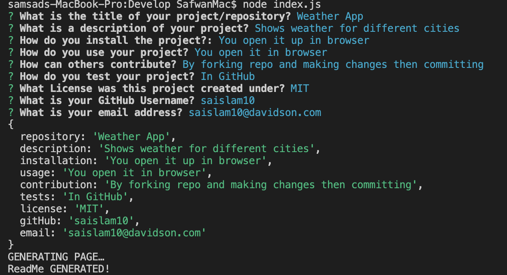
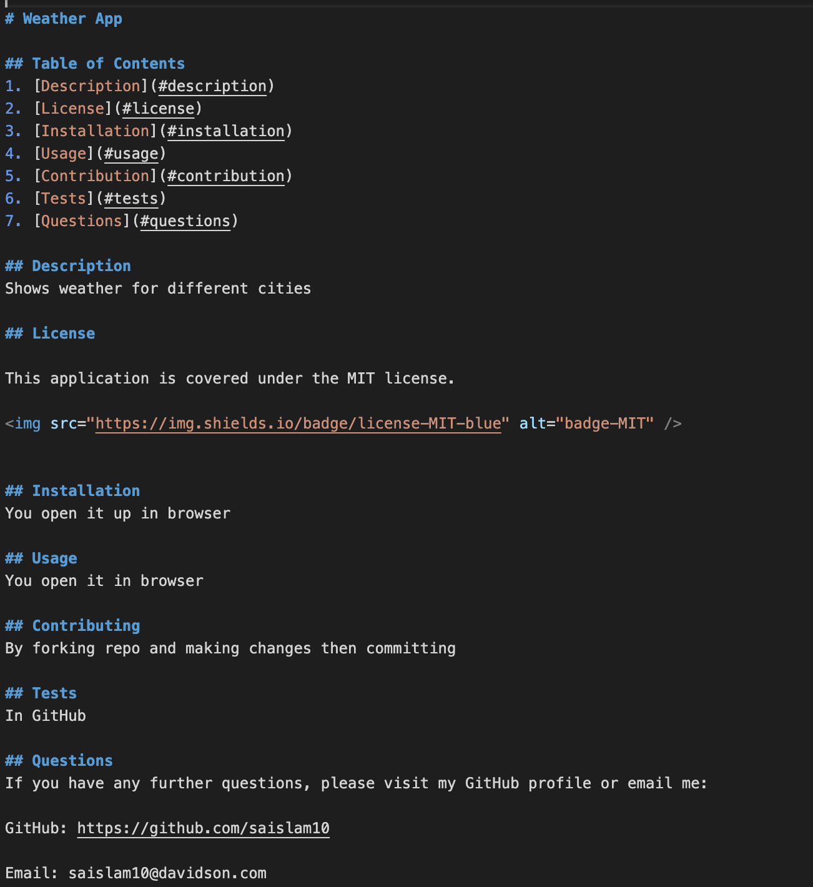
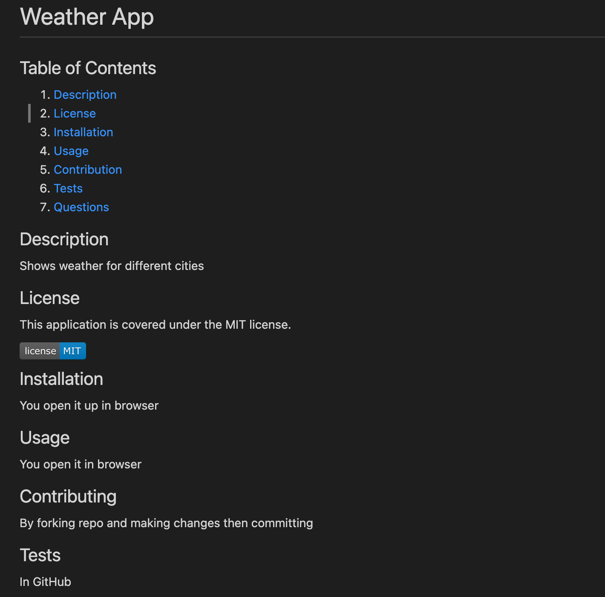

# README Generator

## Table of Contents 
1. [Description](#description)
2. [Visuals](#visuals)
3. [Resources](#resources)

## Author:

Safwan Islam

## Description
In this challenge, there is code which builds out a readme file. Builds out a readme based on user entries for project title, description, installation, usage, contributing, testing, license, gitHub username, and email. The license is made based on a list of entries which outputs a blue license color. Follows all of the criteria given. 

## Visuals
Terminal Entries:

ReadMe:

ReadMe Previewed:

## Resources
[ReadMe Site](https://raw.githubusercontent.com/saislam10/readme-creator/main/Develop/output/README.md)

[Video Link](https://drive.google.com/file/d/1lmq9Mf77iBmXHQBXgar6ZT1yrgY2layA/view)

[GitHub Repository](https://github.com/saislam10/readme-creator)